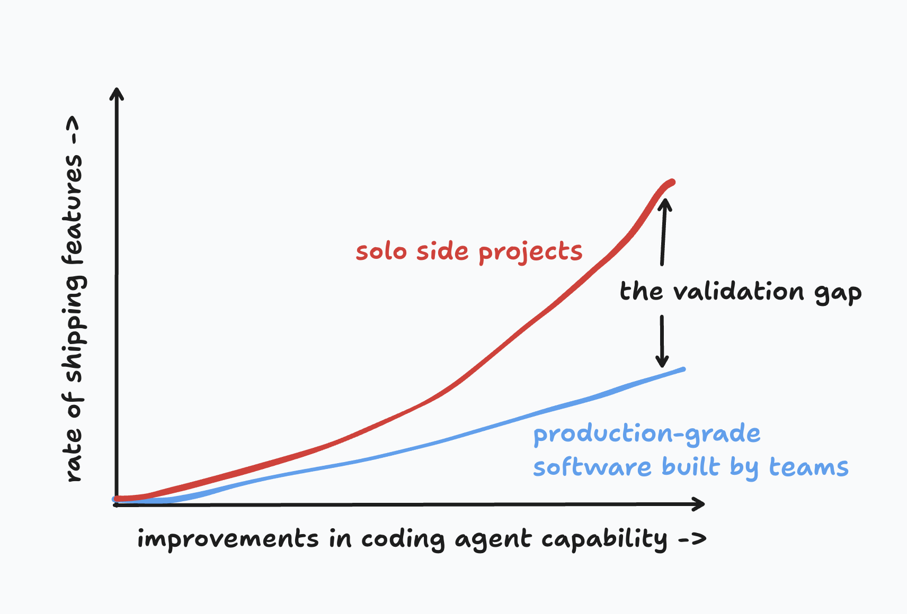

1. automating-code-validation - by Daksh gupta --> My understanding and what I am going to build

automate code validation what they want to achieve

Daytime and nighttime coding (this explains everything)

since, I am trying to contribute and make meaningful changes(rather than code works only changes) Review is very big thing, I got to know it more while working for an org.
I code then use AI to review, it will miss NITS a lot, some-times halluciantes and also forget the rules of the codebase.

I remember when writing unit-test I use to get the suggestion as use cleanup after each test, as AI reviewer only works by diff so they never look on our global setup which already has cleanup after test-cases.
This is was my first time writing unit-test, PR-reviews, and greptile

since then, I really got excited as It works really well in P1 issues in my PR.

I have a plan to build something which I think Greptile might need, but do understand what they are doing I am reading and documenting My understanding of it.

Reaching to this point great but very difficult,
"A large, regulated bank should be able to merge a change to flow-of-funds with only Greptile's approval. No manual code review, no tests, no QA."

since I am into tech which is like 2 years, I am a huge supporter of AI will create a lot of jobs and remove some, but jobs that asks for accountbility is something I am yet to decide, like if a feature breaks in production whom will we point to(who takes accountablity), AI will say SORRY and move on.
I might change my opinion based on more-and-more I learn (A quote I love, its mine not copied , I am sure of it is "The more I learn, the less I know"), But I think an overview by humans will always be there but pressure to go through each line will change and reduce. Like class's monitor goes through the work first and then work goes to subject-teacher, It reduces the pressure from prof so that they can work on their tasks also.

what Greptile does to validate code changes:

1. Deeply understand the product, the business, the codebase, and the intent of the change
   -> Internal knowledge for every part of codebase
   -> Store context about architecture also

2. Understand the "blast radius" of the change
   -> changes are harmless on their own but introduce a new bug two function calls away in an unchanged part of the codebase.

3. Read changed files and change-related files and evaluate the architectural decisions and tradeoffs  
   -> knowledge base, which eliminates the tens of thousands of tokens that the agent would otherwise consume re-learning how the codebase works.
   -> simple tasks like running grep and following traces which are very token-heavy but don't need frontier intelligence, we use fast open source models.

4. Run the code and simulate users to test the application through browser/mobile agents, simulation of production traffic on backend APIs, etc.

5. Ensure the code is secure, through a combination of agents and comprehensive security scans
   Greptile's approach is hybrid. Let agents use deterministic scanners to reduce the entropy of the search space. Use AI to eliminate false positives and detect chained exploits.

6. Continuously learn from other patches, other engineers' comments, etc.
   New PR creates new problems (I got to know this myself), also the PRs merged before or while my PR is being reviwed is also problamatic somethimes (Generally, team discuss it on engineering page or group. Ours was not connected to greptile I feel).

Initially, what I got to know from this talk is that what we need is a frontier model doing the heavy lifting. Whenever and wherever we can use a smaller context model, a cheap model, or an open-source model, we use them as much as we want so that we reduce cost.

It's like we have a WeGov offense per solution, but we go for more efficient WeGov and log in kind of solutions because they are more efficient and cost-saving.

Now I really understand why we have data structure and algorithm (O(n square) to O(nlogn))classes in college, but it's really interesting that we could have only used frontier models and could have made two or three agents who discuss with each other and find out the exact position of which things are wrong. That flow would have been very simple but very time-consuming and also very expensive, especially with this new era of models getting way out of hand for the expense.
